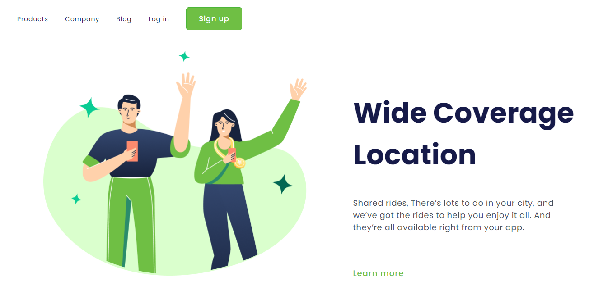

# Wide Coverage Location

> Resultado do Projeto Wide Coverage Location.

### Ajustes e melhorias

O projeto ainda está em desenvolvimento e as próximas atualizações serão voltadas nas seguintes tarefas:

- [x] Criação do HTML
- [x] Criação do CSS
- [ ] Criação do JavaScript
- [ ] Captar os dados dos clientes e enviá los ao destino escolhido

## 🤝 Colaboradora

<table>
  <tr>
    <td align="center">
      <a href="#">
         
        
          <b>Suélen Lima</b>
        
      </a>
    </td>
  </tr>
</table>

[⬆ Voltar ao topo](#Wide-Coverage-Location) 
